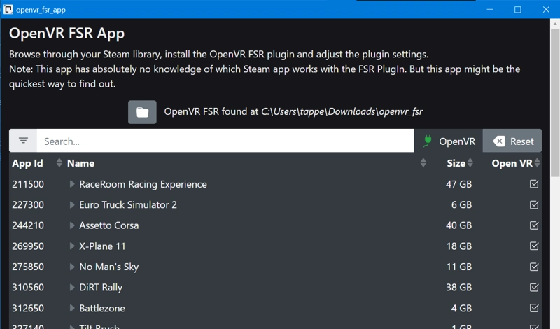

# VR Mod App

Small GUI to install/uninstall, tweak settings of 
 - [Modified OpenVR DLL with AMD FidelityFX SuperResolution Upscaler](https://github.com/fholger/openvr_fsr#modified-openvr-dll-with-amd-fidelityfx-superresolution-upscaler)
 - [OpenVR Foveated Mod](https://github.com/fholger/openvr_foveated)
 - [VR Performance Toolkit](https://github.com/fholger/vrperfkit)

with a single click.

    

Browse through your Steam library, install the OpenVR FSR plugin and adjust the plugin settings.

<b>Note</b>: This app has absolutely no knowledge which Steam app work with the FSR PlugIn. But this app might be the quickest way to find out ;)

### Installation
- Download the <a href="https://github.com/tappi287/openvr_fsr_app/releases">latest installer</a> and start the app
- [Optional] Download latest [openvr_fsr](https://github.com/fholger/openvr_fsr/releases/latest) and point this app to
  the folder where you extracted the latest release
- Navigate through the list of your Steam Library Apps and hit the <i>install</i> buttton to install the PlugIn

## Development Setup
If you'd like to contribute to development, these steps may help you to get up and running:
 - clone this repo `git clone https://github.com/tappi287/openvr_fsr_app`
 - install [Node Package Manager](https://nodejs.org/en/download/) `npm`
 - install yarn `npm install --global yarn`
 - install front-end node modules `yarn install`
 - make sure you have a Python 3.10.x interpreter on your system [python.org/downloads](https://www.python.org/downloads/)
 - install pipenv `python -m pip install pipenv`
 - create python virtual env `pipenv install --dev`
 - if `pipenv` runs into trouble resolving ruamel.yaml dependency, make sure to use latest pipenv release and maybe 
   run `pipenv install ruamel.yaml`once to install the yaml dep
 - switch into the Python virtual env by `pipenv shell`
 - start the app with `python.exe run.py`
 - run tests from test dir with `cd tests` and then `python -m pytest` 
 - build an executable with `python.exe build.py`

  ##### Dev Requirements
 - Python 3.10.x
   - pipenv >= 2022.3.23
   - pytest >= latest
 - npm >= 8.3.1
 - yarn >= 1.22.10
 - Chromium based web browser (Edge, Opera, Chrome) for running in browser app-mode